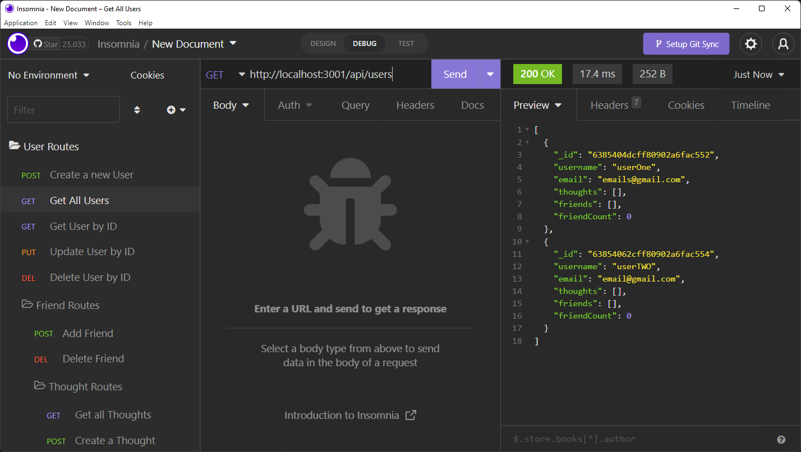
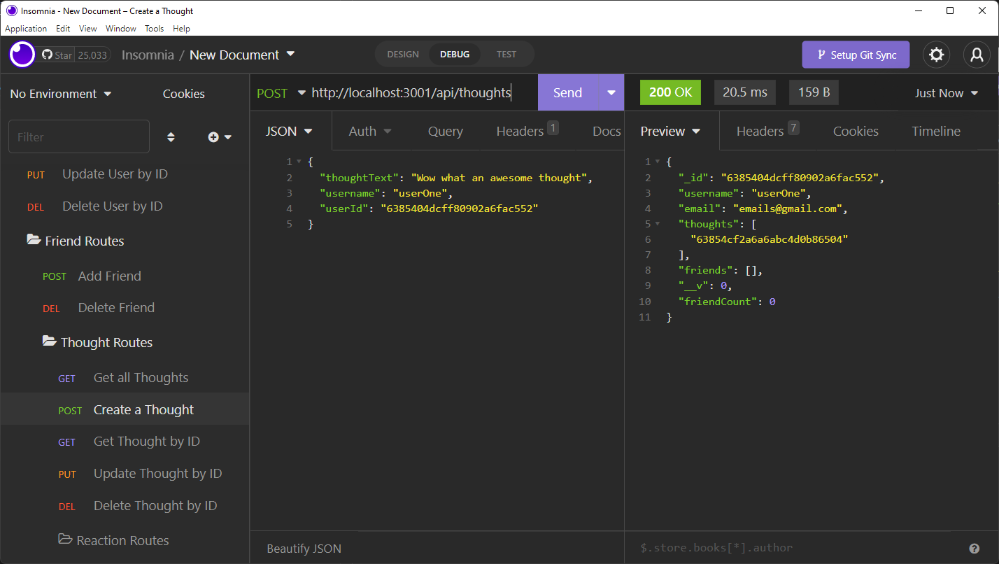

# NoSQL-Social-Network-API

## Description

This is a NoSQL based API for a social network web application where users can share their thoughts, react to friends’ thoughts, and create a friend list. Express.js was used for routing while a MongoDB database and the Mongoose ODM are used to serve and store data.

To view a demonstration video [click-here](https://drive.google.com/file/d/1NLj5Je5KFYrpRGvMp6OkoXqaZiEkm9qo/view)

### Images of Routes

Below is an image of the route to return all Users from the database.

Below is an image of the route to create a new Thought

## Table of Contents

- [Installation](#installation)
- [Usage](#usage)
- [Credits](#credits)
- [License](#license)
- [Contributing](#contributing)
- [Questions](#questions)
- [Tests](#tests)

## Installation

Clone this repo and run `npm install` in the command line

## Usage

A simple database structure for a social network API.

## License

This repository is under the license MIT License.
For more information see https://opensource.org/licenses/MIT

## Contributing

Create a pull request.

## Questions

Please contact me via the following methods.

- Github: [JCaloca](https://github.com/JCaloca)

## Tests

After installing the API locally use Insomnia to test any of the routes created.
